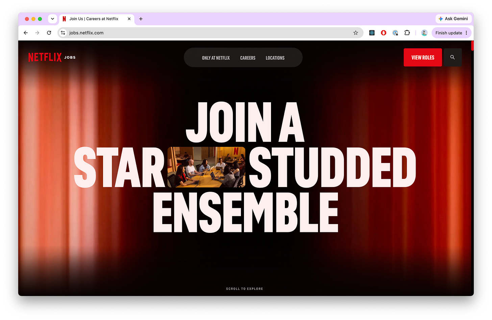
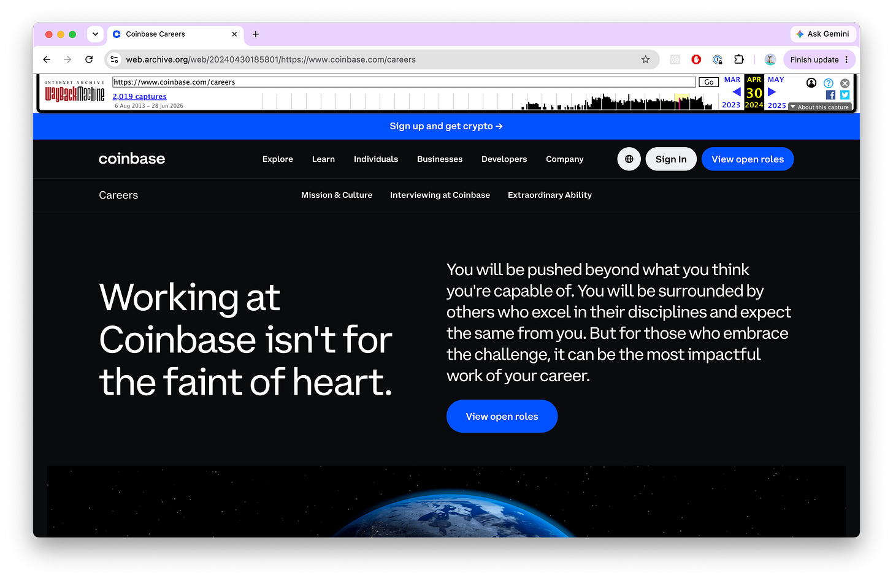
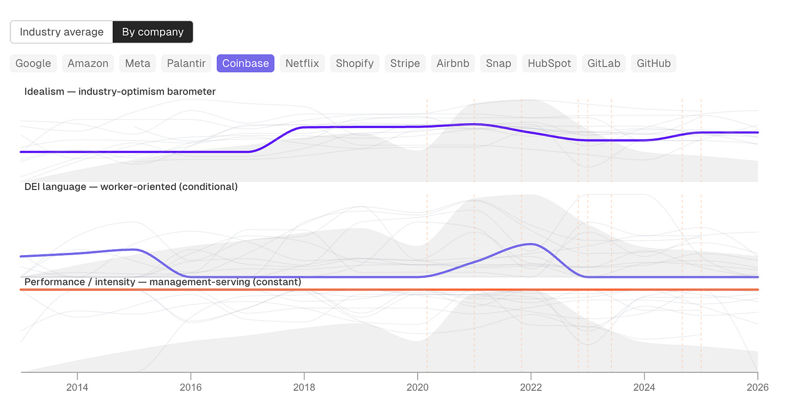

In 2009, Netflix published a [slide deck](https://www.slideshare.net/slideshow/culture-2009/8469957) that Sheryl Sandberg called [“one of the most important documents to ever come out of Silicon Valley”](https://hbr.org/2014/01/how-netflix-reinvented-hr). The content has been attributed to Reed Hastings, the founder of Netflix, and Patty McCord, Netflix’s Chief Talent Officer from 1998–2012. It outlined their approach to hiring, work culture, and performance.

The organizing idea is “freedom and responsibility”: hire the best people, give them few rules, and trust them to act in the company’s best interest. As examples of this, Netflix talks about its unlimited vacation policy and expense policy, which can be summarized as “act in the company’s best interest”. It tells managers to lead “with context, not control”. Real values, it argues, aren’t the words on the lobby wall; they’re revealed by who actually gets rewarded, promoted, and let go.

And it has a lot to say about letting people go. The stated goal is to raise “talent density” faster than complexity grows, meaning they want to keep the team small and exceptional, and remove anyone who is merely fine. “Adequate performance gets a generous severance package.” The mechanism for deciding is called “the keeper test”: would a manager fight to keep this person if they tried to leave? If not, they go.

I can tell the deck was influential because the language keeps showing up on other companies’ careers pages, sometimes almost word for word.

> “Adequate performance gets a generous severance package.” — Netflix, 2009
>
> “Unremarkable performance gets a generous severance package.” — Coinbase, 2024

[I’ve been pulling careers-page copy out of the Wayback Machine](https://languageofwork.netlify.app) and analyzing how it changes over time—embedding each chunk, scoring it on axes like idealism, well-being, and performance, and tracking where a company’s language drifts year over year. (I wrote up the method in more detail [here](https://open.substack.com/pub/beccabailey/p/the-death-of-changing-the-world).) For this research, I took the ideas from the Netflix deck, turned them into AI-generated embeddings, and went looking for who echoed them and when.

Of course, it’s hard to know what is directly derived from the deck, and what is just the general ethos of Silicon Valley, shared between many companies. In addition to the Coinbase quote above, I also found a similar direct lift at Meta when they said “we have values, not rules” in 2016.

### “Animals”

In 2005, four years before the Netflix deck, Paul Graham, the founder of Y-Combinator, [described the kind of person you want to hire in a startup](https://paulgraham.com/start.html). He described his perfect hires as “animals.” According to Graham, “it means someone who takes their work a little too seriously; someone who does what they do so well that they pass right through professional and cross over into obsessive.” It means: “a salesperson who just won’t take no for an answer; a hacker who will stay up till 4:00 AM rather than go to bed leaving code with a bug in it; a PR person who will cold-call _New York Times_ reporters on their cell phones; a graphic designer who feels physical pain when something is two millimeters out of place.”

So basically... people who have no boundaries.

Then Graham says the part everyone forgets: “You don’t need or perhaps even want this quality in big companies, but you need it in a startup.” But then in 2009, Netflix said _But what if it applied to us too?_

### The missing scoreboard

The most-quoted line in the Netflix deck makes the whole move explicit: “We’re a team, not a family. We’re like a pro sports team, not a kid’s recreational team.” The coach’s job is to hire, develop, and cut smartly so there’s a star in every position.

But in case this isn’t already clear, here’s the big difference between a professional basketball player and a software engineer. In basketball, every player is tasked with getting the same regulation ball into the same regulation height hoop on a regulation-sized court as many times as possible within 48 minutes. Performance can be measured by how many points you score and how many times you prevent the other team from scoring.

But how does any company know they have the “best” talent? How do you measure a software engineer on an infrastructure team against a software engineer on a customer support team or a software engineer working in user experience?

By Netflix’s own admission, they largely don’t. The whole system rests on the keeper test, and the keeper test is a manager’s vibes with a fancy name. The deck even refuses to keep score: “we have no bell curves or rankings or quotas such as ‘cut the bottom 10% every year’”, but they still demand that every employee is a high performer.

I looked at this across the whole corpus, about 2,000 culture statements. The word “performance” and its cousins show up constantly. But do you know how many times a company mentions having a specific metric for measuring performance? Zero times. I know this is just the careers page copy, so there’s a lot of internal policy I can’t see. But I still think it’s worth noting that across all the company data I have, I didn’t once find a metric.

### “Talent density” comes to Coinbase

Here’s where the timing gets interesting.

Coinbase cut 18% of its staff in June 2022 and another 20% in January 2023. Over two thousand people, framed both times as a response to the market. Then in November 2023, after the cuts, they published a [blog post called “Talent density at Coinbase”](https://www.coinbase.com/blog/talent-density-at-coinbase) that formalized the philosophy and included the nearly direct quote from Netflix: “Unremarkable performance gets a generous severance package”.

And by February 2024, they re-wrote their careers page. Before this, it was more idealistic. The headline was “Build the future of finance”, and it included language about inclusion and belonging. Now, it leads with the bold assertion: “Working at Coinbase isn’t for the faint of heart.” “Belonging at Coinbase” is gone from the nav. In its place: “Extraordinary Ability.”

Two months. From join-our-mission to survive-our-gauntlet. From belonging to individuality. This isn’t drift; it’s a rebrand, and it happened _after_ they’d already proven they would cut you.

### The real order of operations

The tempting reading is that the _you probably aren’t good enough for us_ language is a warning—companies talk tough, then the layoffs come. The Coinbase sequence says it’s the reverse. The cuts came first. The philosophy came second, to explain them. The careers-page rebrand came third, to sell the explanation as an identity.

Performance language isn’t predictive; it’s retrospective. It’s the story a company tells after a budget decision has already been made, dressed up so the decision looks like merit instead of math. Coinbase didn’t lay people off because it discovered they were unremarkable. It laid people off, then published a page telling the whole world that unremarkable people get laid off.

**Which is why, for a lot of tech workers, the performance conversation is more likely to follow a budget cut than a missed deadline.**

### The data I can feel in my bones

I’m not arguing that performance isn’t real, or that it can’t be measured. But I’m noting that it’s interesting that companies keep resurrecting the same language about performance when the labor market changes.

What Coinbase makes legible is a pattern I keep finding across the whole dataset. When I overlay careers-page language against the quit rate, the copy moves with the labor market. Idealism and inclusion language swell when workers can walk, and thin out when they can’t.

This matters to me because it’s _data that I can feel in my bones_. It’s data that confirms a tonal shift that I have observed, but never quantified. I don’t know about you, but it’s really hard to get a job as a tired 37-year-old mom who doesn’t feel like being a rockstar at work anymore. It doesn’t mean that I don’t care, or I’m bad at my job, but I want to stop trying so hard. And everywhere I look, tech companies just keep telling me to try harder. If I’m not succeeding, it must be because I don’t have “extraordinary ability” or something like that.

If you’re also here, I want you to know that the language on these pages doesn’t give you power, and it can’t take it from you. The language shifts with the market, not with your merit.

---

📊 If you would like to learn more about my data or methodology, interactive charts and examples can be found [here](https://languageofwork.netlify.app/).
