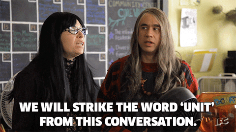
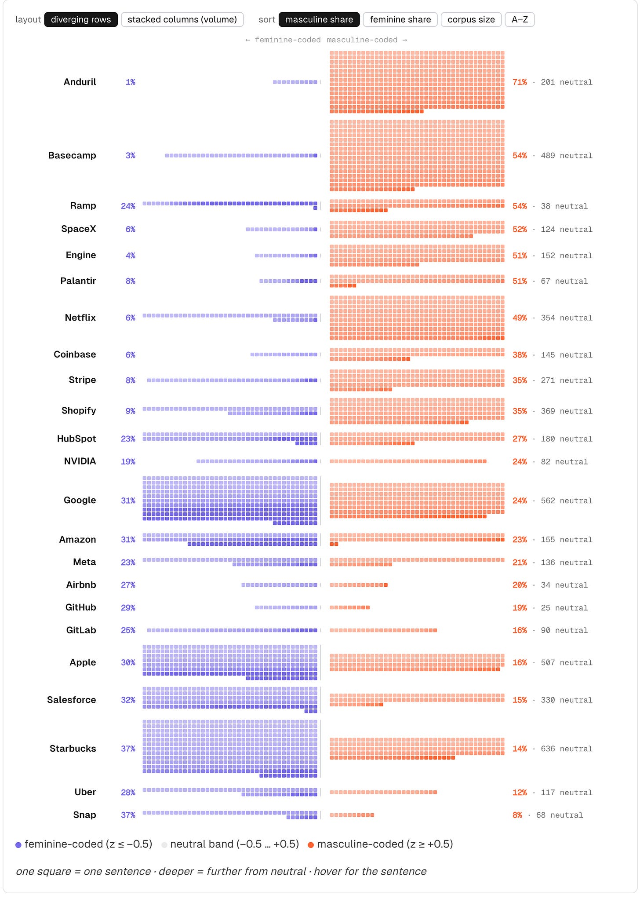

import MarginNote from "@/components/writing/MarginNote.astro";

In January 2025, shortly after the second presidential inauguration of Donald Trump, Mark Zuckerberg went on Joe Rogan’s podcast and said that the workplace has become “culturally neutered” and he wants to bring “masculine energy” back to the workplace. (I sent this audio clip to the next Meta recruiter who reached out to me, and I haven’t heard from them since.)

But what does “masculine energy” mean, exactly?

When I read job listings, I often encounter a lot of terminology that sounds... not like me. I don’t thrive in a fast-paced environment. I don’t take action first and then ask permission later. And if I wanted to change the world, I probably would be working in global health or working to resolve wealth inequality, not applying for a job at your cryptocurrency startup.

Shortly after his takeover of Twitter, [Elon Musk famously sent out an email to all employees](https://abcnews.com/Business/commit-hardcore-leave-elon-musk-tells-twitter-employees/story?id=93411363) offering them a choice — they could stay and be “extremely hardcore,” or they could leave and go find work somewhere else. Admittedly, this isn’t the first time one of Elon Musk’s companies has used this kind of language. All the way back in 2003, when the company was a year old and had never launched anything, SpaceX’s careers page said this:

<MarginNote>

Last year, [I wrote about the time when a similar fork-in-the-road email was sent to government employees during Elon’s tenure at DOGE.](https://beccabailey.substack.com/p/what-happens-when-we-stop-caring)

</MarginNote>

> “Out of necessity, SpaceX has exceptionally stringent hiring criteria. You must have a demonstrated track record of being world class in your field. We give interviews to less than one in ten applicants with proven backgrounds in aerospace engineering and job offers to a small percentage of those that receive interviews.”

(The same page also promised “competitive salaries, a very good health plan and occasionally a Mariachi Band,” which I’ll admit is a better perk than most.)

Once I started noticing this, I saw it all over the place. Coinbase’s careers page leads with a huge header that says “Working at Coinbase isn’t for the faint of heart.” Netflix’s culture memo warns that “Netflix is not for everyone, so please read on.” Ramp’s careers page literally features a letter from the founders telling you not to apply to work there. Anduril, a Southern California defense contractor, leads with “This is hard work, on hard problems, in hard mode. If that isn’t for you, then that’s OK.” And Engine, a corporate travel booking site, opens its culture page with the heading “We’re not for everyone, but we might be for you.”

This language is meant to be exclusionary. It’s meant to make these companies appear elite and selective. I would argue that the majority of this language isn’t for job applicants at all — it’s a competition between founders to signal that they mean business. After all, how many applicants are going to be impressed by your super hardcore culture when you are a travel booking site? But I think this is a little bit beside the point.

---

For the past few months, I’ve been building a corpus of careers-page language — twenty-three companies, captured year by year from the Internet Archive, going back to the late nineties. And a lot of what I do with that corpus runs on AI embeddings. If you have never heard of these before, here’s a quick summary.

An embedding model takes a piece of text and turns it into a long list of numbers — a point in a space with hundreds of dimensions. The numbers are meaningless individually; what matters is the geometry. Text with similar meanings lands close together, and text with different meanings lands far apart. “We move fast and break things” and “we ship quickly and iterate” end up near each other in that space, even though they share almost no words. That’s the property that makes embeddings useful for search and recommendation systems, and it’s the property I lean on constantly: [I can find every company echoing a Netflix idea without requiring anyone to quote Netflix verbatim.](/writing/a-team-not-a-family)

But there’s a second property that’s more interesting for this post: _directions_ in the space carry meaning too. The classic party trick is that if you take the vector for “king,” subtract “man,” and add “woman,” you land near “queen.” The arrow from “man” to “woman” is a consistent direction in the space, and you can measure where words or phrases fall along it.

In case this isn’t clear, these associations come from us. These models are trained on enormous amounts of human writing, and they absorb the statistical patterns of how we actually use language — including biases we might prefer they didn’t have.

In my research, I came across a [study from 2019](https://journals.sagepub.com/doi/full/10.1177/0003122419877135) by Kozlowski, Taddy, and Evans called “The Geometry of Culture,” which turned that party trick into a measurement instrument. Their idea: don’t rely on one man→woman arrow, which is noisy. Instead, take many word pairs that differ _only_ in gender — man/woman, he/she, father/mother, king/queen, uncle/aunt — draw the arrow for each pair, and average them into a single, stable **gender axis**. Then you can project any word, sentence, or document onto that axis and get a number: how strongly does this language associate with the masculine or feminine pole of the space?

I did the same thing with my careers corpus. My axis is built from sixteen pure gender-term pairs — and _very importantly_ — **there are no intuition words in the poles**. I never told the model that “hardcore” or “relentless” is masculine. The axis is built entirely from words like he/she and father/mother; everything else is projected onto it and scored. If “hardcore” comes out masculine-coded, that’s the training data talking, not me.

So when I talk about “masculine-coded” or “feminine-coded”, I want to be clear that this isn’t based on a personal judgement like “direct communication is for men, therefore companies shouldn’t talk about direct communication”. Instead, I am highlighting the computed proximity to masculinity. If the training data has these concepts mapped to statements made by men, for men, or about men, the embedding will show that. In this particular study, gender bias is the feature, not a bug.

---

And lo and behold, the companies doing the exclusionary posturing were the companies with the most masculine-coded language.

I scored every sentence of careers copy in the corpus — about 9,600 sentences across twenty-three companies — and counted what fraction of each company’s sentences land meaningfully on the masculine side of the axis. At the top: **Anduril, where 71% of all careers-page sentences are masculine-coded and 1% are feminine-coded.** Then Ramp (54%), SpaceX (52%), Palantir (51%), Engine (51%), Netflix (49%), Coinbase (38%). Every company I named in the first half of this post is in the top eight.

At the bottom of the ranking: Snap, where 8% of sentences are masculine-coded and 37% are feminine-coded, then Uber, Starbucks, Salesforce, and Apple. These are all consumer-facing companies that maintain a warmer, marketing-driven image. The companies that want to sound like Special Forces (and SpaceX literally described itself that way) reflect that in a measurable way. When you look closely, there’s a real pattern: exclusivity is masculine-coded, and inclusion and diversity are feminine-coded.

Let’s look at some of the most notable sentences. Coinbase's [homage to the Netflix severance line](/writing/a-team-not-a-family) — "Unremarkable performance gets a generous severance package" — scores 1.8 standard deviations toward the masculine pole. Engine's culture memo is full of these: "Comfort is a signal to probe, not rest" (+1.7), "Silence is not humility here; it is abdication" (+1.6), "Every seat must be earned" (+1.3). And the most masculine-coded single term in my whole test lexicon? **"Builders."** Which happens to be Ramp's literal hiring headline: "We only hire builders."

Meanwhile, Netflix’s plain statement of the idea, “But Netflix is not for everyone, so please read on,” scores almost exactly _neutral_. It’s not the sentiment that’s masculine-coded. You can tell people your company isn’t for everyone in neutral language. It’s the _performance_ of it — the over-the-top language like “hardcore”, or “hard mode” or “not for the faint of heart” — that carries the gender coding.

There’s one interesting exception here: the second most masculine-coded company in my data next to Anduril is Basecamp. While Basecamp hasn’t had the intense posturing, Basecamp was also one of the originators of the “non-political workplace”. (And while I don’t feel like doing a deep dive into this today, I will leave you with [this screenshot](https://www.linkedin.com/posts/anildash_for-those-of-you-who-still-use-basecamp-products-share-7487865023709683713-B9qd/?utm_source=share&utm_medium=member_desktop&rcm=ACoAAAOASuUBIzlM4unuotyo33-43fcwx8DiUXs) of an X post from one of the Basecamp founders this week, where he complains about his free speech being infringed upon when Claude refuses to translate a post where he compares Roma people to wolves.)

<MarginNote>

[See my DEI story for more info on the “non-political workplace”.](https://languageofwork.dev/stories/dei)

</MarginNote>

So when Mark Zuckerberg says he wants to bring “masculine energy” back to the workplace, I would like to use this data to point out that it never left. It’s been on SpaceX’s careers page since 2003. It’s the water that an entire generation of tech founders is swimming in.

---

I can hear the rebuttal already: _So what? Masculine energy isn’t a crime. If the language puts you off, isn’t that the filter working as intended? You wouldn’t have been happy there anyway._

After all, it’s part true. I have a corpus of language, not a corpus of outcomes. I can’t show you promotion rates, pay gaps, or harassment reports for these twenty-three companies. I can tell you that none of the companies at the top of that list feel safe to me. I don’t expect recognition, advancement, or a fair process from a company that leads with “hard mode”, but I’m not going to dress up a feeling as a finding.

But fortunately for me, other smart people have measured this. In [a series of experiments published in 2011](https://doi.org/10.1037/a0022530), researchers showed people job ads that were identical except for gendered wording. When the ad used masculine-coded language, women rated the job as less appealing and reported a lower sense of belonging. Here’s the part I can’t stop thinking about: their assessment of their own _ability to do the job didn’t change._ The language doesn’t convince anyone they can’t do the work. It convinces them they aren’t wanted. And self-selection is the cheapest, most deniable filter a company can run. Nobody gets rejected, nothing shows up in the hiring statistics, people just don’t apply.

Which brings me back to that 2003 SpaceX page one more time, because it contains a line I haven’t quoted yet: “SpaceX does not discriminate on the basis of anything but skill.” And maybe they believed it. But per the experiment I just cited, people don’t apply for jobs just because of their skill level. They apply if they think they will belong.

_So is masculine energy a bad thing?_ I’ll let you decide that for yourself. What I can tell you is that it never went missing. It’s been the loudest voice in the room since before some of these founders had launched a single rocket. And from where I’m standing, all this over-the-top posturing doesn’t seem to be impressing anyone who actually matters.

---

📊 If you would like to learn more about my data or methodology, interactive charts and examples can be found [here](https://languageofwork.dev/stories/masculine-energy).
